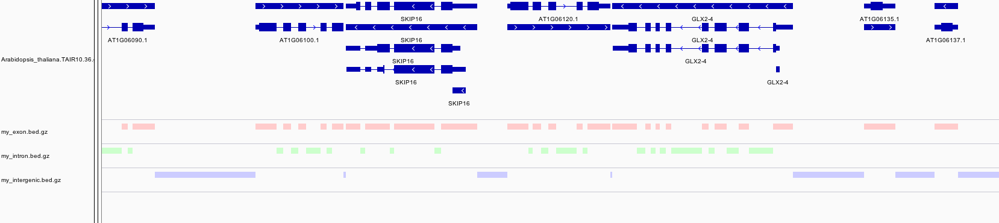

Defining genomic regions
========================

Define regions in a reference genome by simply using [BEDTools](http://bedtools.readthedocs.io/en/latest/) and a GTF file. The IGV screenshot is based on the *Arabidopsis thaliana* example below.



To clone this repository:

```bash
git clone https://github.com/davetang/defining_genomic_regions.git
```

## Install BEDTools

To get started, install BEDTools, if you haven't already.

```bash
git clone https://github.com/arq5x/bedtools2.git
cd bedtools2
make clean; make all
```

## Download GTF file

Next you will require a [GTF](https://genome.ucsc.edu/FAQ/FAQformat#format4) file. I'll use a GTF file for *Arabidopsis thaliana*.

```bash
wget -c ftp://ftp.ensemblgenomes.org/pub/release-36/plants/gtf/arabidopsis_thaliana/Arabidopsis_thaliana.TAIR10.36.gtf.gz

gunzip -c Arabidopsis_thaliana.TAIR10.36.gtf.gz | head
#!genome-build TAIR10
#!genome-version TAIR10
#!genome-date 2010-09
#!genome-build-accession GCA_000001735.1
#!genebuild-last-updated 2010-09
1       araport11       gene    3631    5899    .       +       .       gene_id "AT1G01010"; gene_name "NAC001"; gene_source "araport11"; gene_biotype "protein_coding";
1       araport11       transcript      3631    5899    .       +       .       gene_id "AT1G01010"; transcript_id "AT1G01010.1"; gene_name "NAC001"; gene_source "araport11"; gene_biotype "protein_coding"; transcript_source "araport11"; transcript_biotype "protein_coding";
1       araport11       exon    3631    3913    .       +       .       gene_id "AT1G01010"; transcript_id "AT1G01010.1"; exon_number "1"; gene_name "NAC001"; gene_source "araport11"; gene_biotype "protein_coding"; transcript_source "araport11"; transcript_biotype "protein_coding"; exon_id "AT1G01010.1.exon1";
1       araport11       CDS     3760    3913    .       +       0       gene_id "AT1G01010"; transcript_id "AT1G01010.1"; exon_number "1"; gene_name "NAC001"; gene_source "araport11"; gene_biotype "protein_coding"; transcript_source "araport11"; transcript_biotype "protein_coding"; protein_id "AT1G01010.1"; protein_version "1";
1       araport11       start_codon     3760    3762    .       +       0       gene_id "AT1G01010"; transcript_id "AT1G01010.1"; exon_number "1"; gene_name "NAC001"; gene_source "araport11"; gene_biotype "protein_coding"; transcript_source "araport11"; transcript_biotype "protein_coding";
```

## Define exons

Exons are already defined in the GTF file, so we simply need to print lines that are marked exonic.

```bash
gunzip -c Arabidopsis_thaliana.TAIR10.36.gtf.gz |
awk 'BEGIN{OFS="\t";} $3=="exon" {print $1,$4-1,$5}' |
bedtools sort |
bedtools merge -i - | gzip > my_exon.bed.gz
```

## Define introns

To obtain introns, we simply need the gene and exonic coordinates; by subtracting the exonic regions from the genic region, we have the intronic region.

```bash
gunzip -c Arabidopsis_thaliana.TAIR10.36.gtf.gz |
awk 'BEGIN{OFS="\t";} $3=="gene" {print $1,$4-1,$5}' |
bedtools sort |
bedtools subtract -a stdin -b my_exon.bed.gz |
gzip > my_intron.bed.gz
```

## Define intergenic

For the intergenic region, we will require the size of the chromosomes.

```bash
wget http://genome-test.cse.ucsc.edu/~hiram/hubs/Plants/araTha1/araTha1.chrom.sizes
cat araTha1.chrom.sizes | sed 's/^chr//' | sed 's/Cp/Pt/' > tmp
mv tmp araTha1.chrom.sizes

gunzip -c Arabidopsis_thaliana.TAIR10.36.gtf.gz |
awk 'BEGIN{OFS="\t";} $3=="gene" {print $1,$4-1,$5}' |
bedtools sort -g araTha1.chrom.sizes |
bedtools complement -i stdin -g araTha1.chrom.sizes |
gzip > my_intergenic.bed.gz
```

## *Arabidopsis thaliana* regions

How much of the is made up of exonic, intronic, and intergenic regions?

```bash
alias add='perl -nle '\''$i+=$_; END {print $i}'\'''

cat araTha1.chrom.sizes 
1       30427671
5       26975502
3       23459830
2       19698289
4       18585056
Mt      366924
Pt      154478

cat araTha1.chrom.sizes | cut -f2 | add
119667750

# exonic
gunzip -c my_exon.bed.gz | awk '{print $3-$2}' | add
47821763
bc -l<<<47821763*100/119667750
39.96211427055326100808

# intronic
gunzip -c my_intron.bed.gz | awk '{print $3-$2}' | add
18164145
bc -l<<<18164145*100/119667750
15.17881384082177529033

# intergenic
gunzip -c my_intergenic.bed.gz | awk '{print $3-$2}' | add
53769447
bc -l<<<53769447*100/119667750
44.93227874678014753348

# slightly off total
bc -l<<<15.17881384082177529033+44.93227874678014753348+39.96211427055326100808
100.07320685815518383189
```

## hg19 reference genome

If you are working with hg19, simply run `make` to create all the different genomic regions.

```bash
make

# if everything ran successfully
for file in `ls *.gz`; do md5sum $file; done
bd83e28270e595d3bde6bfcb21c9748f  gencode.v19.annotation.gtf.gz
8c97ec4b54eaa176ba1e48bfeb60c08a  gencode_v19_exon_merged.bed.gz
ea03038b873ba2612383a4c0949c835d  gencode_v19_intergenic.bed.gz
4d5ff850e3115077bf50d87bc406a84f  gencode_v19_intron.bed.gz
48dbe15f4498baad1a2327c774a692c8  promoter.bed.gz
9d513cad3aafd5690bf8bbebb24b4df4  transcript_utr.bed.gz
35aed6aac655182c653cdc72060b914d  transcript_utr_number.out.gz
```

## Annotate BAM files

```bash
samtools sort my_file.bam my_file
bedtools2/bin/bedtools bamtobed -i my_file.bam > my_file.bed
cat my_file.bed | wc -l
bedtools2/bin/bedtools intersect -a my_file.bed -b gencode_v19_exon_merged.bed.gz -u | wc -l
bedtools2/bin/bedtools intersect -a my_file.bed -b gencode_v19_intergenic.bed.gz -u | wc -l
bedtools2/bin/bedtools intersect -a my_file.bed -b gencode_v19_intron.bed.gz -u | wc -l
```

## Further reading

See assoicated blog post: <https://davetang.org/muse/2013/01/18/defining-genomic-regions/>

